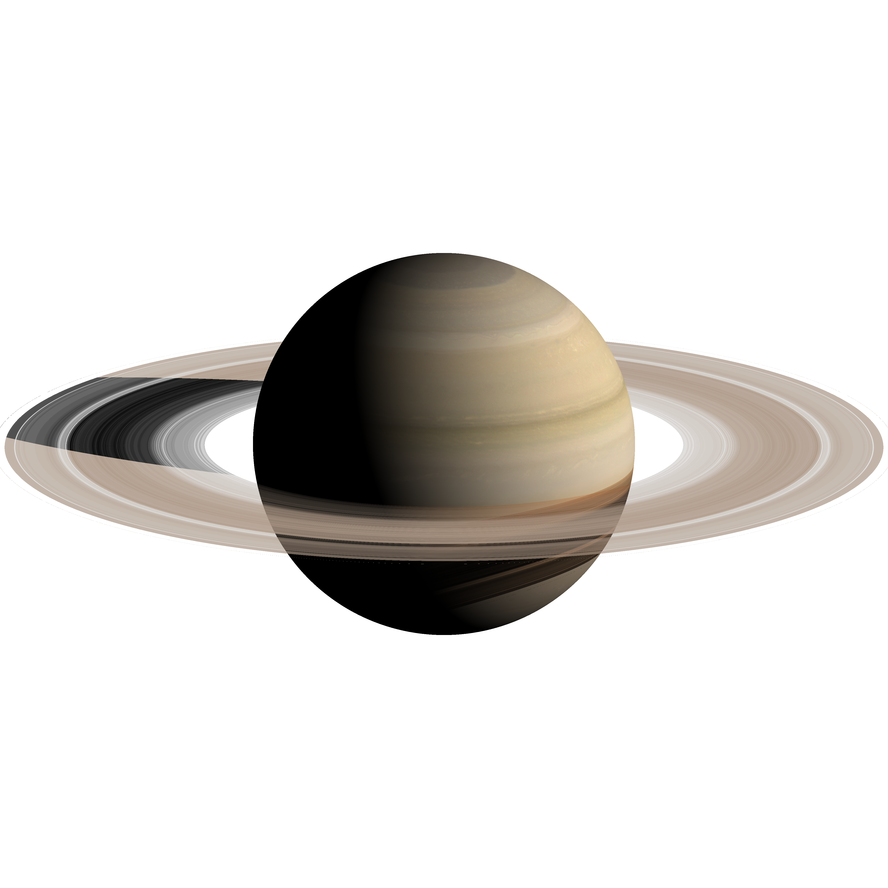

# Saturn in [POV-Ray](http://www.povray.org/)

This script render a synthetic image of Saturn and its rings under specific geometry conditions.

## Inputs
- Targeted planet: `Saturn`
- Instrument: `Cassini ISS Wide Angle Camera`
- Geometry:
	- Observer: `15ºN - 0ºW @ 4,500,000 km`
	- Sun: `20ºN - 290ºW`

## Usage:
```bash
povray +H1024 -W1024 +UA Saturn.pov
```

## Synthetic image:



## Saturn Map
[Maps](./../tree/master/maps) folder contents Saturn maps.

## Rings
[Rings](./../tree/master/rings) folder contents the `python` code used to generate the rings from ISS observations.