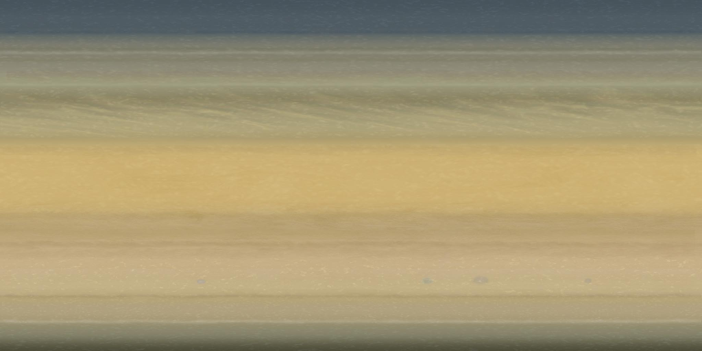

# Surface Global Maps
Global cylindrical map centered at (0ºN,180ºW).

## Sources
- [`Björn Jónsson - Cassini`](http://bjj.mmedia.is/data/saturn/index.html): ISS RGB @ CB1 - Synthetic - BL1 / September 2015
 
- [`Björn Jónsson - Voyager`](http://nautilus.fis.uc.pt/astro/ss/mapa.php?dir=maps/saturno/saturno_BJ): Unkown / December 2003
 
- [`Solar System Scope`](http://www.solarsystemscope.com/nexus/textures/planet_textures/): Unknown, April 2014
 
- [`Deviant Art`](http://uxmal750ad.deviantart.com/art/Saturn-Planetary-Texture-Stock-Image-509267806): Cassini / Unknown / January 2015
 

## Output
- [`Björn Jónsson - Cassini map`](http://bjj.mmedia.is/data/saturn/index.html)
 
- [`Björn Jónsson - Voyager map`](http://bjj.mmedia.is/data/saturn/index.html)
 
- [`Solar System Scope map`](http://www.solarsystemscope.com/nexus/textures/planet_textures/)
 
- [`Deviant Art map`](http://uxmal750ad.deviantart.com/art/Saturn-Planetary-Texture-Stock-Image-509267806)
 
